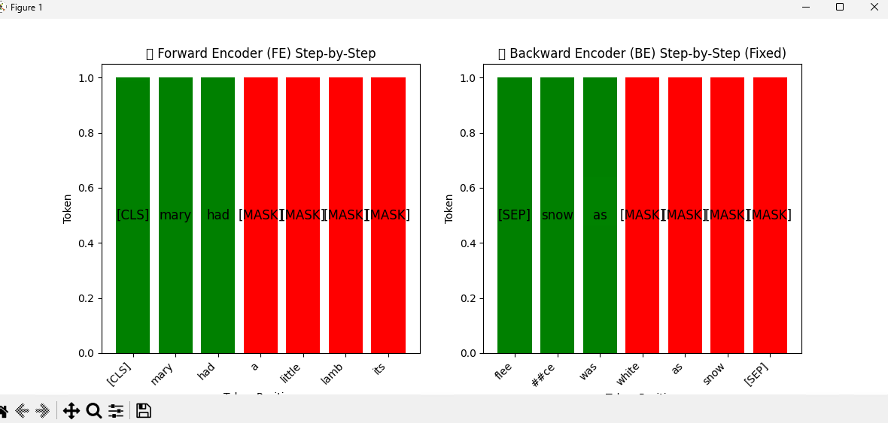

# **Belief State Transformer (BST) - Python Implementation**

## **Overview**
The Belief State Transformer (BST) is an advanced AI model that enhances language generation by encoding **both past and future context**. Unlike traditional forward-only models, BST leverages **bidirectional reasoning** to improve coherence, planning, and structured text generation.

This repository provides a **PyTorch implementation** of BST along with a **step-by-step visualization** demonstrating how the Forward Encoder (FE) and Backward Encoder (BE) operate in tandem.

## **Features**
✅ Implements BST using PyTorch
✅ Step-by-step visualization of FE & BE
✅ Efficient inference using belief state encoding
✅ Optimized for long-form text generation

## **Installation**
### **🔹 Prerequisites**
Ensure you have **Python 3.11+** installed on your system.

### **🔹 Install Dependencies**
Use the following command to install the required dependencies:
```bash
pip install -r requirements.txt
```

## **Usage**
### **1️⃣ Running the BST Model**
To run the BST model for **random token generation**, execute:
```bash
python bst-model-random-token.py
```

To run the BST model for **sentence processing**, execute:
```bash
python bst-model-sentence.py
```

### **2️⃣ Running the Visualization**
To visualize how the **Forward Encoder (FE) and Backward Encoder (BE)** work:
```bash
python visualize_FE_BE_bst.py
```

For **only Backward Encoder (BE) visualization**, execute:
```bash
python visualize_BE.py
```

This will generate a **step-by-step animation** showcasing how BST processes a sentence bidirectionally.

## **Project Structure**
```
📂 BST-Implementation
│── 📂 bstenv                 # Virtual environment (if applicable)
│── 📜 bst-model-random-token.py  # BST model processing random tokens
│── 📜 bst-model-sentence.py      # BST model processing full sentences
│── 📜 visualize_BE.py            # Visualization for Backward Encoder (BE)
│── 📜 visualize_FE_BE_bst.py     # Visualization for both FE and BE
│── 📜 requirements.txt           # List of required dependencies
│── 📜 README.md                  # Project documentation (this file)
```

## **Visualization Example**

The visualization script provides an **animated step-by-step** breakdown of BST’s **Forward Encoder (FE)** and **Backward Encoder (BE)**.

### **Example Output:**


## **How BST Works**
1️⃣ **Forward Encoder (FE)** processes input from **left to right**.
2️⃣ **Backward Encoder (BE)** reconstructs context from **right to left**.
3️⃣ **Final belief state** merges both perspectives for coherent text generation.

## **Performance Optimizations**
- 🚀 **Latent Caching**: Reduces redundant computations.
- 🚀 **Parallel Processing**: Runs FE & BE simultaneously.
- 🚀 **Precomputed BE(∅)**: Faster inference with minimal overhead.

## **Contributing**
We welcome contributions! If you have ideas for improving the implementation, feel free to fork the repository, create a branch, and submit a pull request.

## **License**
This project is licensed under the MIT License - see the `LICENSE` file for details.

