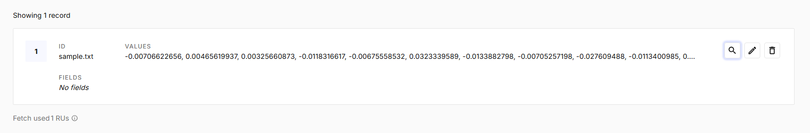
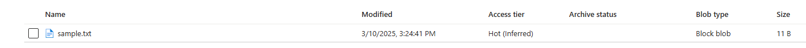
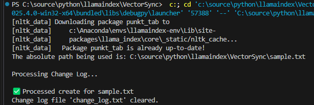

# VectorSync: Document Synchronization with Azure Blob Storage and Pinecone

This repository demonstrates a simple document synchronization pipeline using Azure Blob Storage as a document repository and Pinecone as a vector database for semantic search.  Change events (create, update, delete) are simulated and processed from a log file. **[Refer to this blog post for more information - CloudAIApp.dev](https://cloudaiapp.dev/keeping-your-vector-database-fresh-strategies-for-dynamic-document-stores/)**. Install instructions can be found **[here](INSTALL.md)**

## Overview

The system consists of the following components:

*   **Azure Blob Storage:** Stores the actual document content.
*   **Pinecone:** A vector database used to store embeddings of the document content, enabling efficient semantic search.
*   **Change Log:** A simple text file used to simulate a message queue, recording document change events.
*   **Change Handler:** Processes the change log, synchronizing the document content with Pinecone.

## Prerequisites

*   Python 3.13+
*   Azure Subscription
*   Pinecone Account

## Setup

1.  **Install Dependencies:**

    ```bash
    pip install azure-storage-blob pinecone-client llama-index-embeddings-azure-inference python-dotenv
    ```

2.  **Environment Variables:**

    Create a `.env` file in the root directory and set the following environment variables:

    ```
    AZURE_LLM_END_POINT="your_azure_llm_endpoint"
    AZURE_LLM_API_VERSION="your_azure_llm_api_version"
    AZURE_LLM_MODEL_NAME="your_azure_llm_model_name"
    AZURE_LLM_ENGINE="your_azure_llm_engine"
    AZURE_EMBED_END_POINT="your_azure_embed_endpoint"
    AZURE_EMBED_MODEL="your_azure_embed_model"
    AZURE_EMBED_API_VERSION="your_azure_embed_api_version"
    AZURE_OPENAI_KEY="your_azure_openai_key"
    PINECONE_API_KEY="your_pinecone_api_key"

    # Optional (with default values for local testing)
    AZURE_STORAGE_ACCOUNT_NAME="default_account"
    AZURE_STORAGE_CONTAINER_NAME="default_container"
    AZURE_STORAGE_CONNECTION_STRING="default_connection_string"
    PINECONE_ENVIRONMENT="us-east-1"
    PINECONE_INDEX_NAME="blooming-cypress"
    ```

    *   **Important:** Replace the placeholder values with your actual Azure and Pinecone credentials. The Azure OpenAI key has been renamed to `AZURE_INFERENCE_CREDENTIAL` in the code.  If your environment variables still use `AZURE_OPENAI_KEY`, you will need to update `config.py`.

3.  **Azure Blob Storage Setup:**

    *   Create an Azure Storage account.
    *   Create a container within your storage account.
    *   Update the `AZURE_STORAGE_ACCOUNT_NAME`, `AZURE_STORAGE_CONTAINER_NAME`, and `AZURE_STORAGE_CONNECTION_STRING` environment variables in the `.env` file. You can use either the account name/container name for development purposes or connection string for full functionality.

4.  **Pinecone Setup:**

    *   Create a Pinecone account.
    *   Create an index (ideally before you run the code). If the index does not exist, the code will attempt to create one automatically. If you are using the code for testing, note that the script is configured to create a ServerlessSpec cloud using aws, in region us-east-1.
    *   Update the `PINECONE_API_KEY`, `PINECONE_ENVIRONMENT`, and `PINECONE_INDEX_NAME` environment variables in the `.env` file.  The default index name is `blooming-cypress`.

## Usage

1.  **Run the Main Script:**

    ```bash
    python main.py
    ```

    This script will:

    *   Upload a sample document ("sample.txt") to Azure Blob Storage.
    *   Simulate a "create" change event in the `change_log.txt` file.
    *   Process the change log, which will:
        *   Download the document from Azure Blob Storage.
        *   Generate an embedding for the document content using your configured Azure embedding model.
        *   Upsert the embedding into the Pinecone index.
        *   Clear the `change_log.txt` file.

2.  **Simulating Change Events:**

    You can simulate different change events by modifying the `main.py` script:

    *   **Create/Update:**

        ```python
        change_handler.simulate_change_event("sample.txt", "create", "This is the updated content.")
        ```

    *   **Delete:**

        ```python
        change_handler.simulate_change_event("sample.txt", "delete")
        ```

3.  **Monitoring the Change Log:**

    Examine the contents of `change_log.txt` to observe the change events being recorded.  The `process_change_log()` function automatically clears this file after processing.

## Sample Output

Here are some sample outputs from the execution of the `main.py` script.

### Pinecone Vector

This screenshot shows the vector that has been upserted into Pinecone, with the document ID `sample.txt`.

)

### Azure Blob Storage

This screenshot shows `sample.txt` in the Azure Blob Storage container.



### Terminal Output

This screenshot shows the terminal output from a successful run of `main.py`.



## Code Structure

*   `config.py`: Defines the configuration settings, including environment variables and default values.
*   `azure_blob_storage.py`: Handles interaction with Azure Blob Storage, including uploading, downloading, and deleting documents.
*   `pinecone_handler.py`: Handles interaction with Pinecone, including generating embeddings, upserting vectors, and deleting vectors.
*   `change_handler.py`: Processes the change log file, triggering the synchronization of document content between Azure Blob Storage and Pinecone.
*   `main.py`: The main script that orchestrates the document synchronization process.
*   `sample.txt`: A sample document used for testing (can be any text file).

## Troubleshooting

*   **Missing Environment Variables:** Ensure that all required environment variables are set correctly in the `.env` file.
*   **Pinecone Index Issues:** Verify that the Pinecone index exists and has the correct dimensions (matching your embedding model). This script automatically attempts to create a Pinecone index that matches the dimensions for the AzureAIEmbeddingsModel, however you may need to modify the dimension value if using a different model.
*   **Azure Blob Storage Connectivity:** Check that your Azure Storage account is accessible and that the container exists.  Ensure that you have the necessary permissions to upload, download, and delete blobs.
*   **Error during index create process:** The create index process may time out if resources are limited. Check the dimensions of the index and confirm that it matches the embedding model.
*   **Repeated Processing:** If the same change event is processed multiple times, ensure that the `change_log.txt` file is being cleared correctly after processing. This is achieved with the logic in the process_change_log function. Repeated processing indicates that change_log.txt is being appended to due to repeated executions and/or the clearing fails, leading to more than one entry in the change_log.

## Scalability and Improvements

*   **Message Queue:** Replace the simple `change_log.txt` file with a proper message queue (e.g., Azure Queue Storage, RabbitMQ) for more robust and scalable change event processing.
*   **Asynchronous Processing:** Implement asynchronous tasks to handle document synchronization in the background.
*   **Error Handling:** Add more robust error handling and retry mechanisms.
*   **Real-time Monitoring:** Integrate with monitoring tools for real-time visibility into the synchronization process.
*   **Content Chunking:** Improve search relevance and embedding efficiency by chunking large documents before embedding.

## License

[MIT License](LICENSE)