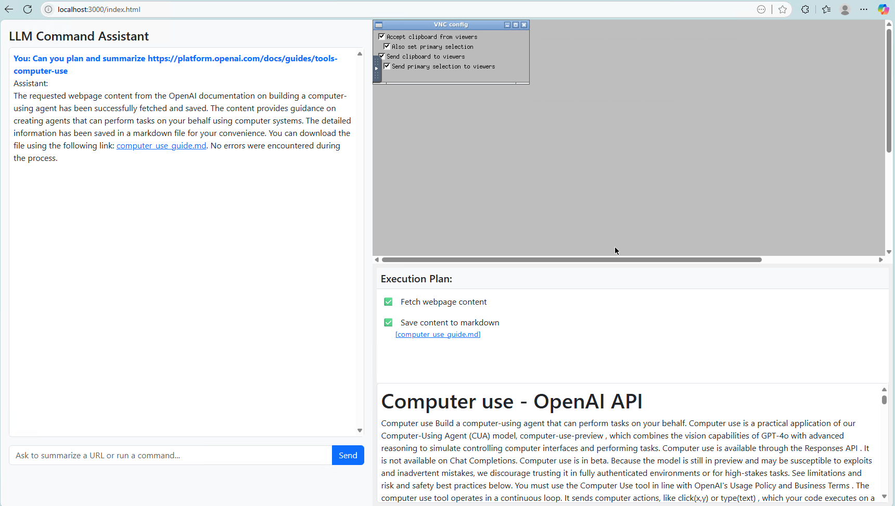
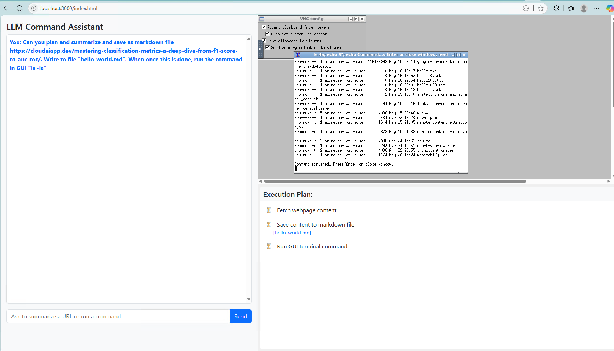

# LLM Computer Control: LangGraph + Function Calling + Chain of Thought

A framework for teaching Large Language Models to use computers through function calling and Chain of Thought reasoning.**[Refer to this blog for more information - CloudAIApp.dev](https://cloudaiapp.dev/extending-pretrained-transformers-with-domain-specific-vocabulary-a-hugging-face-walkthrough/)**.

<figure>
  
  <figcaption>Screenshot showing execution plan and live GUI output</figcaption>
</figure>


## Overview

This project demonstrates how to build an AI agent that can control a computer to perform tasks like:
- Fetching and summarizing web content
- Saving content as markdown files
- Converting markdown to PDF
- Executing terminal commands with visual feedback

The implementation uses Chain of Thought reasoning to break down complex tasks into manageable steps, and LangGraph to orchestrate the execution flow.

## Architecture

### Key Components

- **Backend**: LangGraph-based agent orchestration
  - `langgraph_backend.py`: Core agent logic and execution flow
  - `llm_schema.py`: Pydantic models for structured data
  - `llm_tools.py`: Tool implementations for computer interaction
  - `main.py`: FastAPI server with SSE for real-time updates

- **Frontend**: Simple web UI for interaction
  - `index.html`: Chat interface with execution plan visualization

### Technical Stack

- **LangGraph**: Agent state flow orchestration
- **LangChain**: Tool definition & OpenAI API interface
- **Pydantic**: Strict schemas for each tool
- **FastAPI + SSE**: Backend and live UI
- **VNC + shell**: Visual GUI feedback

## Setup Requirements

### Prerequisites

1. **Linux Environment**: Tested on Ubuntu running in an Azure VM
2. **VNC Server**: Required for visual feedback components
   - Follow [this guide](https://www.digitalocean.com/community/tutorials/how-to-install-and-configure-vnc-on-ubuntu-20-04) for VNC setup on Ubuntu 20.04
3. **Python 3.11+**: Required for all dependencies
4. **OpenAI API Key**: Access to GPT-4o or similar models

### Installation

1. Clone the repository:
   ```bash
   git clone <repository-url>
   cd computer-control
   ```

2. Install dependencies:
   ```bash
   pip install -r requirements.txt
   ```

3. Set up environment variables:
   ```bash
   export OPENAI_API_KEY=your_api_key_here
   ```

4. Configure VM connection parameters:
   Edit `backend/llm_tools.py` to update the following variables with your VM information:
   ```python
   SSH_HOST = "your-vm-dns.cloudapp.azure.com"  # Change to your VM's DNS
   SSH_USERNAME = "your-username"  # Change to your VM username
   SSH_KEY_PATH = "path/to/your/ssh_key.pem"  # Change to your SSH key path
   ```

5. Start the VNC server:
   ```bash
   vncserver :1 -geometry 1024x768 -depth 24
   ```

6. Start the backend server:
   ```bash
   cd backend
   python3 .\backend\main.py
   ```

7. Access the frontend:
   ```bash
   cd frontend
    python3 -m http.server 3000
   ```

## Usage

1. Enter a command in the chat interface, such as:
   - "Plan and summarize the content from https://example.com"
   - "Plan, summarize and save the content from https://example.com as a 'example.pdf' PDF file"
   - "Run the command 'ls -la' in the terminal"

2. The system will:
   - Generate a plan using Chain of Thought reasoning
   - Execute each step in the plan
   - Provide real-time updates on execution progress
   - Return the final result

<figure>
  
  <figcaption>Final result of the execution plan and live GUI output</figcaption>
</figure>

<figure>
  
  <figcaption>Terminal command output</figcaption>
</figure>

## Key Features

### Step ID-Based Tracking

The system uses unique step IDs instead of indices for robust execution:

```python
# Current implementation
class AgentState(TypedDict):
    current_step_id: str  # String-based unique identifier
    step_outputs: Dict[str, StepOutput]  # Dictionary keyed by step_id
    step_order: List[str]  # Maintains execution order
    completed_steps: List[str]  # Tracks completed steps
```

This enables:
- Parallel tool execution
- Robust error handling
- Step dependencies
- Dynamic plan modification

### Chain of Thought Planning

The system uses structured Chain of Thought reasoning to break down complex tasks:

```python
class PlanStep(BaseModel):
    step: str = Field(description="The name of the step.")
    action: str = Field(description="The command to execute.")
    step_id: str = Field(description="A unique identifier for the step.")
```

### Remote Content Extraction

The system uses undetected_chromedriver for reliable web content extraction:

```python
def fetch_rendered_html(url: str, wait=8) -> str:
    options = uc.ChromeOptions()
    options.add_argument("--disable-blink-features=AutomationControlled")
    driver = uc.Chrome(options=options, headless=False)
    # ... fetch content ...
```

## Important Disclaimer

This implementation is provided as demonstration code only and is not production-ready. It lacks several critical components:

- **No Security Guardrails**: Unlike commercial implementations, this code does not include comprehensive safety mechanisms
- **Limited Error Handling**: The error recovery capabilities are basic
- **No Rate Limiting**: There are no protections against excessive API usage
- **Minimal Validation**: Input and output validation is present but not exhaustive

Users should exercise caution when running this code and should not deploy it in production environments without significant additional development and security testing.

## Future Enhancements

- Add multi-modal tools (image upload, PDF ingestion)
- Implement workflow checkpointing with Redis
- Add agent memory and summarization
- Implement security guardrails
- Create generalizable prompt templates
- Enhance parallel execution capabilities

## License

[MIT License](LICENSE)

## Acknowledgments

- OpenAI for the function calling API
- LangChain and LangGraph teams for the agent frameworks
- Anthropic for their research on computer-using AI agents
